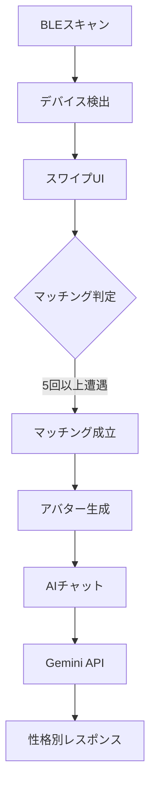

# 💕 Bluetooth Love
*~運命の出会いはBluetooth接続から~*

[](https://flutter.dev/)
[](https://dart.dev/)
[](https://supabase.com/)

BLEデバイスをスキャンして運命の人を見つける、革新的なマッチングアプリです。近くにいる人のスマートフォンを検出し、スワイプでマッチング、そしてAIキャラクターとのチャットを楽しめます。

## 📱 スクリーンショット

```
🎬 タイトル画面    📱 BLEスキャン    💫 マッチング    💬 AIチャット
[動画背景付き]  → [デバイス検出]  → [スワイプUI]  → [性格別対話]
```

## ✨ 主な機能

### 🔍 **BLEスキャン**
- 近くのiPhone/Androidデバイスを自動検出
- RSSI値による距離測定
- 位置情報との連動で常連デバイス分析

### 💕 **スワイプマッチング**
- Tinder風のスワイプインターフェース
- 右スワイプ（Like）・左スワイプ（Nope）
- 5回以上遭遇でマッチング成立

### 🤖 **AIチャット**
- **10種類の性格**から選択（優しい・クール・可愛い・攻撃的・色気・明るい・恥ずかしがり屋・ミステリアス・元気・知的）
- **Google Gemini API**による自然な対話
- **多言語対応**（日本語・英語）

### 🎨 **アバターシステム**
- **3つのスタイル**：アニメ風・リアル風・イラスト風
- MACアドレスベースの一貫したアバター割り当て
- カスタマイズ可能なアバターグループ

### 🎁 **アイテム機能**
- ギフトアイテムで親密度アップ
- 性格別の反応システム
- 特定キャラクター専用アイテム（タバコ等）

### 🎵 **リッチメディア**
- 背景動画（タイトル・マッチング成功）
- BGM（タイトル・チャット・マッチング・スワイプ）
- 効果音（マッチング成功・アクション音）

### 🌐 **多言語対応**
- 日本語・英語のフル対応
- UIテキスト・AIチャット・アイテム説明すべて対応

## 🛠 技術スタック

### **フロントエンド**
- **Flutter 3.8.1+** - クロスプラットフォーム開発
- **Dart 3.0+** - プログラミング言語

### **バックエンド**
- **Supabase** - BaaS（データベース・リアルタイム機能）
- **PostgreSQL** - メインデータベース

### **外部API**
- **Google Gemini API** - AI対話システム
- **flutter_blue_plus** - BLE通信

### **主要パッケージ**
```yaml
dependencies:
  flutter_blue_plus: ^1.35.5    # BLE通信
  supabase_flutter: ^2.9.1      # バックエンド連携
  permission_handler: ^11.0.1   # パーミッション管理
  geolocator: ^12.0.0           # 位置情報
  audioplayers: ^6.0.0          # 音声再生
  video_player: ^2.8.2          # 動画再生
  http: ^1.1.0                  # API通信
  logger: ^2.6.0                # ログ出力
```

## 🏗 アーキテクチャ

### **プロジェクト構成**
```
flutter_application_1/
├── lib/
│   ├── main.dart                          # メインアプリ・BLE機能
│   ├── personality_selection_page.dart    # 性格選択画面
│   ├── avatar_group_selection_page.dart   # アバターグループ選択画面
│   ├── services/
│   │   ├── personality_service.dart       # 性格・アバター管理
│   │   ├── audio_service.dart            # 音声制御
│   │   └── video_service.dart            # 動画制御
│   ├── models/
│   │   ├── device_model.dart             # BLEデバイスモデル
│   │   └── chat_model.dart               # チャットモデル
│   └── widgets/
│       ├── avatar_widget.dart            # アバター表示
│       ├── background_video_widget.dart  # 背景動画
│       ├── fullscreen_video_widget.dart  # フルスクリーン動画
│       └── slot_machine_widget.dart      # スロットマシンUI
├── assets/
│   ├── avatars/                          # アバター画像
│   ├── audio/                            # 効果音
│   ├── music/                            # BGM
│   └── videos/                           # 背景動画
├── database_schema.sql                   # データベース設計
├── chat_schema.sql                       # チャット機能DB
├── match_events_schema.sql               # マッチイベントDB
├── location_scan_schema.sql              # 位置情報DB
├── README_SUPABASE_SETUP.md             # Supabaseセットアップ
├── MULTI_USER_DEPLOYMENT.md             # デプロイ要件
└── AVATAR_README.md                     # アバター設定ガイド
```

### **データフロー**


## 🚀 セットアップ

### **必要要件**
- Flutter 3.8.1+
- Dart 3.0+
- iOS 12.0+ / Android API 21+
- Supabaseアカウント
- Google Gemini APIキー

### **1. リポジトリクローン**
```bash
git clone https://github.com/rick08698/BLE-Pass-by-Communication-Mobile-Application.git
cd BLE-Pass-by-Communication-Mobile-Application
```

### **2. 依存関係インストール**
```bash
flutter pub get
```

### **3. Supabaseセットアップ**
詳細は [README_SUPABASE_SETUP.md](README_SUPABASE_SETUP.md) を参照

1. [Supabase Dashboard](https://app.supabase.com) でプロジェクト作成
2. データベーススキーマのインポート：
```sql
-- 以下のSQLファイルを順番に実行
database_schema.sql
chat_schema.sql  
match_events_schema.sql
location_scan_schema.sql
```

3. `lib/main.dart` の設定値を更新：
```dart
await Supabase.initialize(
  url: 'YOUR_SUPABASE_URL_HERE',
  anonKey: 'YOUR_SUPABASE_ANON_KEY_HERE',
);
```

### **4. Google Gemini API設定**
1. [Google AI Studio](https://makersuite.google.com/app/apikey) でAPIキー取得
2. `lib/main.dart` で設定：
```dart
static const String _geminiApiKey = 'YOUR_GEMINI_API_KEY_HERE';
```

### **5. アセットの配置**
必要なメディアファイルを配置：
```bash
# アバター画像
assets/avatars/avatar1.png ~ avatar5.png

# BGM・効果音
assets/music/*.mp3
assets/audio/*.mp3

# 動画ファイル
assets/videos/title_background.mp4
assets/videos/confession_success.mp4
```

### **6. パーミッション設定**

#### **Android** (`android/app/src/main/AndroidManifest.xml`)
```xml
<uses-permission android:name="android.permission.BLUETOOTH" />
<uses-permission android:name="android.permission.BLUETOOTH_ADMIN" />
<uses-permission android:name="android.permission.BLUETOOTH_SCAN" />
<uses-permission android:name="android.permission.BLUETOOTH_CONNECT" />
<uses-permission android:name="android.permission.ACCESS_FINE_LOCATION" />
<uses-permission android:name="android.permission.ACCESS_COARSE_LOCATION" />
```

#### **iOS** (`ios/Runner/Info.plist`)
```xml
<key>NSBluetoothAlwaysUsageDescription</key>
<string>This app uses Bluetooth to find nearby devices for matching.</string>
<key>NSLocationWhenInUseUsageDescription</key>
<string>This app uses location to enhance matching accuracy.</string>
```

### **7. 実行**
```bash
# デバッグ実行
flutter run

# リリースビルド
flutter build apk --release    # Android
flutter build ios --release    # iOS
```

## 🎮 使用方法

### **初回起動フロー**
1. **言語選択** - 日本語/English
2. **性格選択** - 10種類から好みの性格を選択
3. **アバタースタイル選択** - アニメ風・リアル風・イラスト風から選択
4. **アプリ開始** - メイン画面へ

### **基本的な使い方**
1. **「スタート」** でBLEスキャン開始
2. 検出されたデバイスを **右スワイプ（Like）/左スワイプ（Nope）**
3. **5回以上遭遇** で自動マッチング
4. **マッチング成功** でチャット開始
5. **性格に応じたAIキャラクター** との対話を楽しむ

### **高度な機能**
- **アイテムショップ**: ギフトで親密度アップ
- **位置情報分析**: 常連デバイスの分析
- **プロフィール編集**: 名前・年齢・自己紹介の設定
- **設定**: 言語切り替え

## 📊 データベース設計

### **主要テーブル**
- `ble_scan_results` - BLEスキャン結果
- `chat_messages` - チャットメッセージ
- `match_events` - マッチングイベント
- `location_scans` - 位置情報スキャン履歴

詳細なスキーマは各SQLファイルを参照してください。

## 🎨 カスタマイズ

### **アバターの追加・変更**
詳細は [AVATAR_README.md](AVATAR_README.md) を参照

### **新しい性格タイプの追加**
`lib/services/personality_service.dart`の`availablePersonalities`に追加：
```dart
{'style': 'new_style', 'name': '新しい性格'},
```

### **AIレスポンスのカスタマイズ**
`lib/main.dart`の話題レスポンスマップを編集してカスタマイズ可能

## 📱 デプロイ

### **開発テスト**
- 複数デバイスで同時実行してBLE通信をテスト
- 実機でのテストが必須（シミュレーターではBLE機能利用不可）

### **本番デプロイ**
- **iOS**: App Store Connect経由
- **Android**: Google Play Console経由

詳細は [MULTI_USER_DEPLOYMENT.md](MULTI_USER_DEPLOYMENT.md) を参照

## 🔧 トラブルシューティング

### **よくある問題**

#### **BLE接続問題**
```bash
# パーミッションエラーの場合
flutter clean
flutter pub get
# デバイス設定でBluetoothとLocation権限を確認
```

#### **Supabase接続エラー**
- URL・APIキーの設定を確認
- RLSポリシーの設定を確認
- ネットワーク接続を確認

#### **アセット読み込みエラー**
```bash
# アセットが見つからない場合
flutter clean
flutter pub get
# pubspec.yamlのassets設定を確認
```

#### **Gemini API エラー**
- APIキーの有効性を確認
- APIクォータの残量を確認
- リクエスト形式の確認

### **ログ出力**
```dart
// デバッグログの有効化
Logger logger = Logger();
logger.d("デバッグメッセージ");
```

## 🤝 コントリビューション

### **開発に参加するには**
1. Forkしてください
2. フィーチャーブランチを作成 (`git checkout -b feature/amazing-feature`)
3. 変更をコミット (`git commit -m 'Add amazing feature'`)
4. ブランチにプッシュ (`git push origin feature/amazing-feature`)
5. Pull Requestを作成

### **コード規約**
- Dart公式の[Style Guide](https://dart.dev/guides/language/effective-dart/style)に従う
- コメントは日本語で記載
- 新機能追加時はREADMEも更新

## 📄 ライセンス

このプロジェクトは[MITライセンス](LICENSE)の下で公開されています。

## 📞 サポート

### **質問・バグ報告**
- [GitHub Issues](https://github.com/rick08698/BLE-Pass-by-Communication-Mobile-Application/issues)
- [Discussions](https://github.com/rick08698/BLE-Pass-by-Communication-Mobile-Application/discussions)

### **ドキュメント**
- [Supabaseセットアップ](README_SUPABASE_SETUP.md)
- [アバター設定ガイド](AVATAR_README.md)
- [デプロイ要件](MULTI_USER_DEPLOYMENT.md)

## 🎯 ロードマップ

### **v1.1 (予定)**
- [ ] プッシュ通知機能
- [ ] より多くのアバタースタイル
- [ ] グループチャット機能

### **v1.2 (予定)**  
- [ ] 音声メッセージ機能
- [ ] AR機能統合
- [ ] カスタムアバター作成

---

**💡 このアプリで、あなたの運命の出会いを見つけましょう！**

*Made with ❤️ by the Bluetooth Love Team*